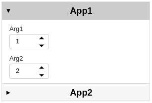
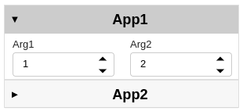
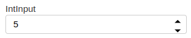
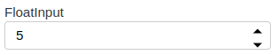
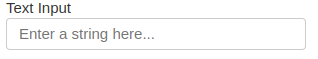
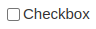

Graphic User Interface Development Guide
========================================

Overview
--------

The front end (GUI) of iMars3D is built on top of the `holoviz <https://holoviz.org/>`_ stack, primarily utilizing the `panel <https://panel.holoviz.org/>`_ and `param <https://param.holoviz.org/>`_ library.
The overall design philosophy are:

- derive the user interface from the backend functions with helper functions instead of building one from ground up
- consistent choice of widgets for each type of parameter

Widget Design Principles
------------------------

The widgets derived from backend functions should be constructed with provided (TBD) parsers.
Each widget should have a member function called ``panel`` to return the overall widgets.
When grouping several widgets together, please consider using ``panel.Accordion`` as the container.
Instead of directly executing the corresponding backend function, the widget should self-serialize its parameters into a dictionary.
The dictionary will be passed to an executor function to execute the backend functions in the order of their addition.

(Examples will be updated once the parser and executor function is finalized.)

.. code:: python

    import panel as pn
    import param
    import numpy as np
    pn.extention()

    # demo functions from backend
    class func1(param.ParameterizedFunction):
        arg1 = param.Integer(default=1, bounds=(0, 100), doc="arg1")
        arg2 = param.Integer(default=2, bounds=(0, 100), doc="arg2")

        def __call__(self, **params):
            _ = self.instance(**params)
            p = ParamOverrides(self, params)
            return p.arg1 + p.arg2

    class func2(param.ParameterizedFunction):
        arg1 = param.Integer(default=1, bounds=(0, 100), doc="arg1")
        arg2 = param.Integer(default=2, bounds=(0, 100), doc="arg2")

        def __call__(self, **params):
            _ = self.instance(**params)
            p = ParamOverrides(self, params)
            return p.arg1 * p.arg2

    # demo widget
    class DemoStage(param.Parameterized):
        data = param.Array(doc="input data array")
        width = param.Integer(default=100, bounds=(0, None), doc="width of the widget")

        def widget_func1(self):
            self.func1 = func1.instance()
            app = pn.Param(
                self.func1,
                widgets={
                    "arg1": pn.widgets.IntInput,
                    "arg2": pn.widgets.IntInput,
                },
                width=self.width,
                show_name=False,  # disable derived name, use accordion label instead
            )
            return app

        def widget_func2(self):
            self.func2 = func2.instance()
            app = pn.Param(
                self.func2,
                widgets={
                    "arg1": pn.widgets.IntInput,
                    "arg2": pn.widgets.IntInput,
                },
                width=self.width,
                show_name=False,  # disable derived name, use accordion label instead
            )
            return app

        def panel(self):
            return pn.Accordion(
                ("App1", self.widget_func1()),
                ("App2", self.widget_func2()),
            )

    # instantiate and display
    demo = DemoStage(data=np.random.rand(10, 10))
    demo.panel().show()

The resulting demo will look like:

For most cases, the default row-stacking layout should be sufficient.
If needed, one can build the widget one component at a time before manually specify the layout.
For example, the member function can also be implemented as below

.. code:: python

    def widget_func1(self):
        self.func1 = func1.instance()
        arg1 = pn.widgets.IntInput.from_param(self.func1.param.arg1)
        arg2 = pn.widgets.IntInput.from_param(self.func1.param.arg2)
        return pn.Row(arg1, arg2, width=self.width)

    def widget_func2(self):
        self.func2 = func2.instance()
        arg1 = pn.widgets.IntInput.from_param(self.func2.param.arg1)
        arg2 = pn.widgets.IntInput.from_param(self.func2.param.arg2)
        return  pn.Row(arg1, arg2, width=self.width)

Now the resulting demo will look like:

Widget Selection
----------------

The UI library `panel <https://panel.holoviz.org/>`_ provides multiple widgets for each input type, and it is very tempting to try out all of them in your app.
However, it is recommended to use the following recommended widgets for each input type so as to maintain an consistent style throughout the entire frontend.

- Integers: use ``panel.widgets.IntInput``

- Floats: use ``panel.widgets.FloatInput``

- Strings:
    - use ``panel.widgets.Select`` when requiring users to select an option from a limited list.
    - use ``panel.widgets.TextInput`` when asking users to provide an arbitrary string.

.. image:: ../_static/images/ui_select.png
    :align: center

- Booleans: use ``panel.widgets.Checkbox``

If you are running into situations where the widgets above are not sufficient, please either raise the question during the status meeting (non-urgent case) or contact a senior developer to check if customized widgets are needed (urgent case).

Useful resources for GUI development
------------------------------------

- ``panel``'s reference gallery (https://panel.holoviz.org/reference/index.html)
- ``param``'s official documentation page (https://param.holoviz.org/user_guide/index.html)
- ``holoviz``'s official discussion forum (https://discourse.holoviz.org/)
