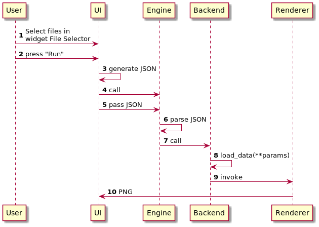

========
Workflow
========

.. contents::
    :local:

Use-case: Loading Data
----------------------

Roles:

* ``User``
* ``UI``
* Workflow Manager (a.k.a ``Workflow``)
* ``Backend``
* ``Logger``
* ``Filesystem``

